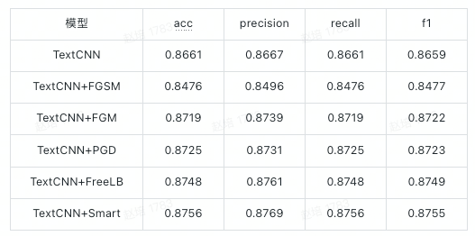

# adversarial_train

<h1> 原理 </h1>
算法详解见：https://zhuanlan.zhihu.com/p/509204147

<h1> 代码实现 </h1>
<h2> 简介  </h2>
在中文文本分类场景下，以TextCNN为基准模型，比较不同对抗训练算法的效果。  
<h2> 数据集 </h2>
使用THUCNews数据集，文本长度在20-30之间，一共10个类别，每个类别2w条数据。  
<h2> 模型效果 </h2>
训练时仅训练5轮，模型相关参数也没专门调，仅跑通流程粗略评估各算法效果。   

测试集效果  

代码参考
https://github.com/tanshoudong/attack_train/tree/main/Attack-Train-Compare-Pytorch

